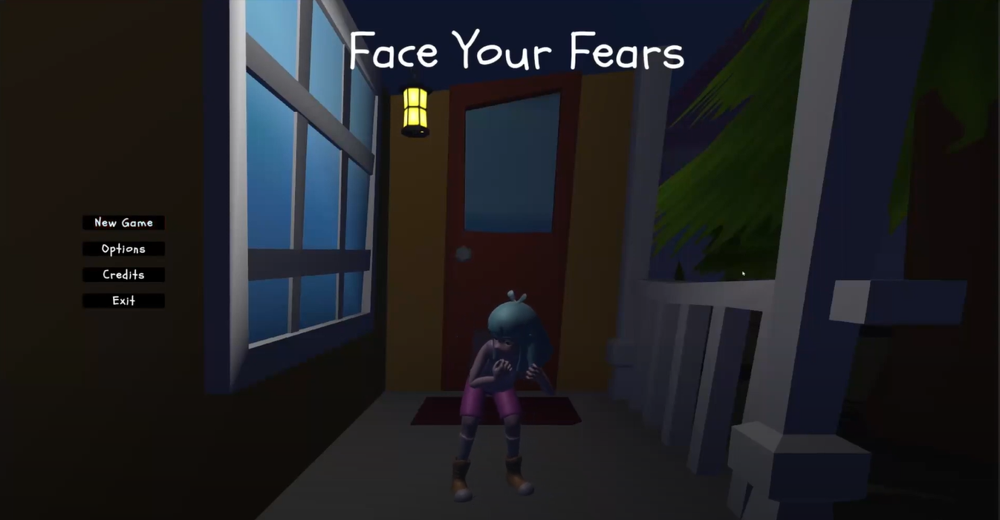
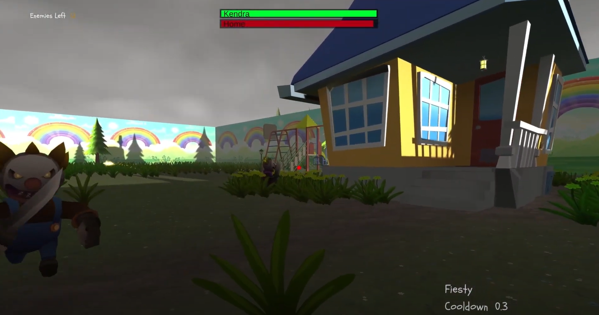
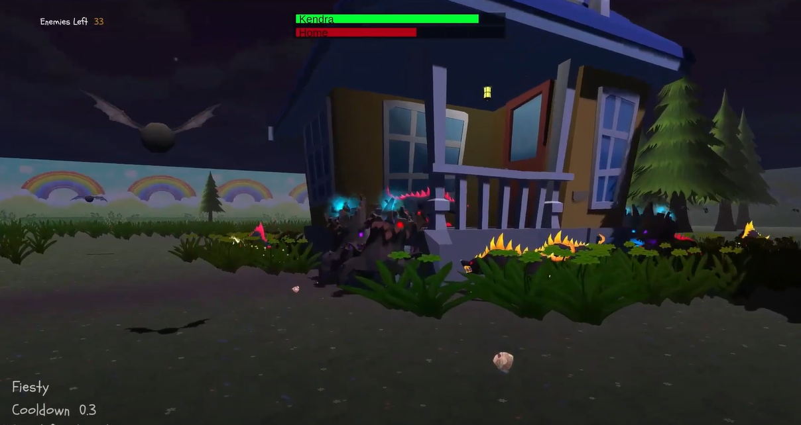

# Face Your Fears 🎮
This is a 3D first-person wave-based castle defense game built in Unity. You play as a child who must fight off their nightmares using unlockable powers and abilities in order to escape their dream.

The project was a collaborative game development effort during college, and I focused heavily on player systems, effects, and gameplay feel.

---

## 💡 Why This Project Matters

This project was my first time developing a complete combat system in Unity from scratch, as part of a team. While the enemies and level design were handled by other members, I was fully in charge of everything that made the player feel responsive and powerful.

It taught me how to:
- Collaborate on Unity projects using Git and Trello
- Create clean, modular systems for combat and abilities
- Connect UI, animation, SFX, and game logic for tight gameplay feedback
- Balance a game’s progression and difficulty around the player experience

---

## 🚀 Core Features

- Fast-paced first-person controller (custom made, not prefab)
- Basic & special projectile attacks with cooldowns
- Animated ability feedback and visual effects
- UI for player HP, reticle, ability feedback, pause/win menus
- Audio for player attacks, damage, and impact sounds
- Full keyboard binding support
- Progression system for unlocking powers

---

## 🧑‍💻 My Contributions

I was responsible for **all player-side systems**, including:

- 🎯 First-person controller (WASD, mouse look)
- 💥 Player projectiles, attacks, hit logic
- 🌟 Special effects on abilities (VFX/SFX triggers)
- 🎵 Player audio cues
- 🔁 Animation state control for player actions
- 🎯 Dynamic reticle & UI feedback for attacks
- ❤️ HP bar and damage UI
- ⏸️ Pause menu and win condition UI
- ⌨️ Input bindings and gameplay feel tuning

---

## 📷 Screenshots

  
  

  

---

## 🎥 Video Demo

  

---

## 🛠️ How to Run

1. Download or clone the repo
2. Run FaceYourFears.exe
3. Hope you have fun!

---

## 👥 Credits

This project was a team collaboration:

- **Player Systems, UI, FX, Combat:** Me (Ricardo Rodriguez)
- **Level Design / Enemy Waves:** Nicholas Barger
- **Enemy Logic / Game Flow:** Joshua Luvene
- **Animation / Lighting / Assets:** Jenna Hendrix

Original commit history retained from the private group repository.

---

## 📝 License

This project is for educational and portfolio use only.
